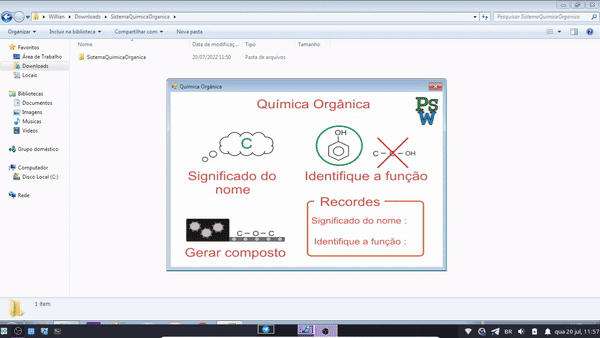

     
    
     

 

# Organic Chemistry

 

Desktop system implemented at the request of the high school chemistry teacher to help students learn the subject of Organic Chemistry. This was an application of gamification in the school environment.

     
    
    
    
     

 
